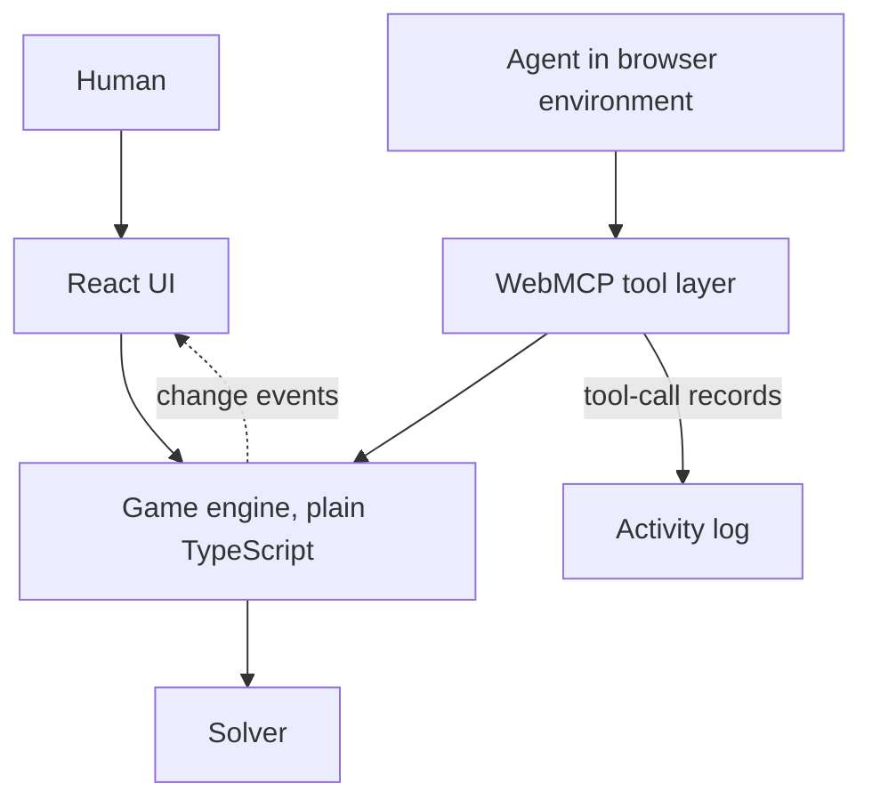

# agentle

## WebMCP-powered collaborative word game

### MVP product + technical specification (revised)

> **Status of this document.** Every WebMCP API detail here was verified against the sources in [section 24](#24-authoritative-references) on 2026-08-25. Where this document and an older tutorial disagree, this document wins. Where this document and the sources in section 24 disagree, **the sources win** — flag the conflict rather than inventing an API.

---

## 1. product overview

Build **agentle**, a five-letter word guessing game where a human and an AI agent play the same puzzle through two different interfaces.

The human plays through the visual board. The agent plays through WebMCP tools. There is exactly one game state underneath.

The agent can:

- inspect the board, the guesses, the feedback and the derived constraints
- rank candidate words and explain why
- propose a guess for the human to approve
- submit a guess when the human has granted that permission
- start a new puzzle

The core claim is not "a word game with AI attached." It is:

> a colour-coded grid is one interface to this game. WebMCP makes conversation a second, equally capable interface to the same game.

### 1.1 naming and trademark constraint

The product is called **agentle**. It is described as "a five-letter word guessing game."

**Do not use the word "Wordle" anywhere in the product, the README, the Devpost description, the repository name, or the demo video.** It is a New York Times trademark, and the hackathon rules forbid third-party trademarks in the submission video. Do not copy NYT's colour palette, logo, typography or curated answer list either.

Inside this document the term is used only to identify the genre for you, the implementer. It must not leak into any artifact.

---

## 2. positioning and impact

The impact claim is **accessibility as an alternative modality**, and it must be stated precisely.

### 2.1 the problem

The genre's standard interface is a 5x6 grid of tiles whose entire information content is conveyed by background colour. That is a poor interface for:

- screen reader users, who receive a flat sequence of letters with the meaning stripped out
- users with colour vision deficiency, for whom green and yellow tiles are the hardest possible pairing
- users with motor impairments, for whom a 26-key on-screen keyboard is a precision task
- low-vision users relying on magnification, who lose the spatial relationship between rows

### 2.2 what WebMCP changes

With tools registered, the same game becomes playable through conversation. The agent reads the board aloud in words, explains what each clue eliminated, offers candidates, and plays on instruction. No grid navigation, no colour perception, no pointer precision.

This is not a substitute for accessible markup. **The human UI must be independently accessible** (see [section 15](#15-accessibility)). The agent is an additional modality, not an excuse.

### 2.3 required precision in all copy

The WebMCP explainer lists "Improve accessibility through agents" as an explicit goal, and immediately qualifies it:

> WebMCP itself is not designed for ingestion by accessibility technology, nor is it designed to interact directly with a page's accessibility tree; rather, it enables agents to act as highly capable intermediaries.

Therefore, in the README, the Devpost description and the video:

- **Claim:** the agent is an alternative way to play the same game, for people the visual grid serves badly.
- **Do not claim:** that WebMCP is an accessibility API, that it replaces ARIA or a screen reader, or that the project is WCAG-conformant.

Overclaiming here is worse than not making the claim at all.

---

## 3. hackathon compliance

Source: OpenAI WebMCP Challenge Official Rules, `webmcp.devpost.com`.

### 3.1 dates

- Submission period: 2026-08-25 11:00 PT to **2026-09-03 13:00 PT**
- Judging: 2026-09-04 to 2026-09-21
- Winners: on or around 2026-09-23

Submit at least 24 hours early. No changes are permitted after the deadline.

### 3.2 judging criteria (equally weighted)

1. **WebMCP Leverage** — thorough, skilful, non-trivial use of WebMCP
2. **Execution** — a complete, coherent product, not a proof of concept
3. **Potential Impact** — a credible, specific case for a real problem and a real audience
4. **Creativity & Ambition** — novelty versus existing concepts

Stage one is pass/fail on theme fit and genuine use of WebMCP.

### 3.3 hard submission requirements

- [ ] A working live URL reachable in the ChatGPT desktop in-app browser or Chrome with WebMCP enabled
- [ ] Public repository on GitHub, GitLab or Bitbucket containing all source, assets and instructions
- [ ] An open source licence file that **GitHub detects and displays in the About panel**. Use a plain, unmodified MIT `LICENSE`. Do not reformat it, do not merge it into another file, do not add commentary — GitHub's detector will stop recognising it.
- [ ] The repository must contain a literal `document.modelContext.registerTool({ ... })` call. Satisfied by [section 12](#12-webmcp-registration-layer).
- [ ] A text description covering the four mandated points in [section 20](#20-devpost-description)
- [ ] A public YouTube video under 3 minutes with audio covering what was built and how WebMCP was used, containing no third-party trademarks and no copyrighted music
- [ ] All commits dated inside the submission window. The repository starts empty, so this is automatic — but do not backdate or import prior work.

One submission per entrant.

### 3.4 note on optional credits

3,000 Netlify credits are available to registered entrants via the form linked in the rules, requested by 2026-09-01 12:00 PT. Not required. Do not let it influence the hosting choice.

---

## 4. MVP goals

### human

Start a game, type guesses with a physical or on-screen keyboard, receive per-letter feedback, see attempts remaining, win or lose, start another game, and ask an agent for help.

### agent

Inspect state, read derived constraints, rank candidates, propose a guess, submit a guess when permitted, and start a new game.

### collaboration

One shared state. Each side sees the other's moves immediately. The human controls how much authority the agent has, and the agent cannot change that.

---

## 5. success criteria

The MVP is done when every box is checked.

### gameplay

- [ ] loads with no account and no network calls after first paint
- [ ] one randomly chosen five-letter target per game
- [ ] six attempts
- [ ] guesses must be five alphabetic characters present in the allowed list
- [ ] invalid guesses are rejected and do **not** consume an attempt
- [ ] feedback is correct, including every duplicate-letter case in [section 8.2](#82-feedback-algorithm-normative)
- [ ] physical keyboard and on-screen keyboard both work
- [ ] win and loss are both detected
- [ ] new game resets everything
- [ ] state survives React re-renders and StrictMode double-mounting

### WebMCP

- [ ] the API is feature-detected and absence is a no-op
- [ ] all five tools register via `document.modelContext.registerTool`
- [ ] every `registerTool` call is awaited and its rejection handled
- [ ] tools call the game engine; no game logic is duplicated in the tool layer
- [ ] every tool output is valid JSON and under 1.5K characters
- [ ] read-only tools carry `readOnlyHint: true`
- [ ] agent mutations update the visible board in the same frame
- [ ] human moves are visible to the next tool call with no refresh
- [ ] invalid tool input returns a structured, self-correcting error and never throws
- [ ] verified working in the ChatGPT desktop in-app browser
- [ ] verified working in Chrome 149+ with the testing flag

### collaboration

- [ ] three modes exist and are switchable only by the human
- [ ] `propose_guess` stages a guess visibly and awaits approval
- [ ] `submit_guess` refuses with `approval_required` while in co-pilot mode
- [ ] approving a staged proposal plays it
- [ ] the human can guess independently at any time and the agent adapts
- [ ] in autonomous mode the agent finishes the game unaided
- [ ] the activity log shows every real tool call, with nothing fabricated

### delivery

- [ ] production build succeeds with no TypeScript errors
- [ ] deployed over HTTPS, publicly reachable, no auth
- [ ] `Origin-Agent-Cluster: ?1` present on document responses
- [ ] public repo with a GitHub-detected MIT licence
- [ ] README covers setup, both WebMCP testing paths, tools and limitations
- [ ] video under 3 minutes, public, trademark-free
- [ ] Devpost description covers all four mandated points

---

## 6. out of scope

No auth, accounts, database, backend, multiplayer, chat backend, leaderboard, analytics, CMS, payments, or third-party services beyond hosting.

**No LLM API calls from this application.** The agent is supplied by the browser environment. The suggestion engine is deterministic local code. Do not add an OpenAI or Gemini API key.

**No fake chatbot.** Do not build a scripted panel that impersonates an agent. The agent panel displays real tool-call history and nothing else.

---

## 7. technology and architecture

### 7.1 stack

React 19, TypeScript in `strict` mode, Vite, Tailwind CSS, Vitest. No state-management library.

Add `webmcp-types` as a dev dependency for the WebMCP typings. Do not hand-write a `declare global` block for `document.modelContext`.

Do **not** add `use-webmcp-tool`. It is an unrelated third-party package and was cited in error in the previous draft. Chrome documents `usewebmcp` as React's experimental helper, but this project registers tools directly, because the WebMCP implementation itself is what is being judged.

### 7.2 architecture



Two rules, both non-negotiable:

1. **The UI and the tool layer never implement game logic.** Both call the engine. Any rule expressed twice will eventually disagree, and a divergence between the board and the tool output destroys the entire premise.
2. **One engine instance.** Create it once at module scope. React subscribes via `useSyncExternalStore`. Do not mirror engine state into `useState` — that is the single most likely source of divergence.

The activity log is not an engine concern. The engine has no concept of tools. Each tool `execute` wrapper appends one record — name, arguments, timestamp, parsed outcome — to a module-scope log store *after* the engine call returns. The UI subscribes to that store the same way it subscribes to the engine. Human keyboard guesses do not create log entries; they are already visible on the board. The log is append-only for the lifetime of the page and must never contain a fabricated or illustrative row.

```ts
export type ActivityEntry = {
  id: number;
  name: string;
  arguments: Record<string, unknown>;
  timestamp: number;
  outcome: unknown; // parsed JSON body, including error payloads
};
```

```ts
// src/game/engineInstance.ts
export const engine = new GameEngine(loadWordLists());

// src/hooks/useGame.ts
export function useGame() {
  return useSyncExternalStore(
    engine.subscribe,        // (cb) => unsubscribe
    engine.getSnapshot,      // must return a stable reference until state changes
  );
}
```

`getSnapshot` must return a cached object that only changes identity when state changes, or `useSyncExternalStore` will loop.

### 7.3 directory structure

```text
agentle/
├── public/
├── src/
│   ├── components/
│   │   ├── Board.tsx
│   │   ├── Tile.tsx
│   │   ├── Keyboard.tsx
│   │   ├── Header.tsx
│   │   ├── GameStatus.tsx
│   │   ├── ModeSwitch.tsx
│   │   ├── AgentPanel.tsx
│   │   ├── ProposalCard.tsx
│   │   └── ActivityLog.tsx
│   ├── game/
│   │   ├── engine.ts
│   │   ├── engineInstance.ts
│   │   ├── feedback.ts
│   │   ├── solver.ts
│   │   ├── dictionary.ts
│   │   └── types.ts
│   ├── webmcp/
│   │   ├── register.ts
│   │   ├── tools.ts
│   │   ├── payloads.ts
│   │   └── activityLog.ts
│   ├── hooks/
│   │   ├── useGame.ts
│   │   └── useActivityLog.ts
│   ├── data/
│   │   ├── answers.ts
│   │   ├── allowed.ts
│   │   └── WORDLIST_LICENSE.md
│   ├── App.tsx
│   ├── main.tsx
│   └── index.css
├── README.md
├── LICENSE
├── vercel.json
├── package.json
├── tsconfig.json
├── vite.config.ts
└── tailwind.config.js
```

---

## 8. game rules

### 8.1 basics

One randomly selected target from the answer list. Six attempts. A guess must be exactly five alphabetic characters and present in the allowed list. Rejected guesses do not consume an attempt.

The target is stored in a private field on the engine and is never returned by any tool while `status === "playing"`.

### 8.2 feedback algorithm (normative)

Implement exactly this two-pass algorithm. Do not attempt a single pass; single-pass implementations get duplicate letters wrong.

```ts
export function scoreGuess(guess: string, target: string): LetterStatus[] {
  const feedback: LetterStatus[] = Array(5).fill("absent");
  const remaining = new Map<string, number>();

  // pass 1: exact positions, consuming from the letter pool
  for (let i = 0; i < 5; i++) {
    if (guess[i] === target[i]) {
      feedback[i] = "correct";
    } else {
      remaining.set(target[i], (remaining.get(target[i]) ?? 0) + 1);
    }
  }

  // pass 2: present letters, only while the pool has that letter left
  for (let i = 0; i < 5; i++) {
    if (feedback[i] === "correct") continue;
    const left = remaining.get(guess[i]) ?? 0;
    if (left > 0) {
      feedback[i] = "present";
      remaining.set(guess[i], left - 1);
    }
  }

  return feedback;
}
```

Required invariants, all of which become tests:

- `scoreGuess(w, w)` is five `correct`
- for any letter, `count(correct) + count(present) <= count of that letter in target`
- `scoreGuess` is pure and allocation-only; no engine state is read

Golden cases that must pass. Each was hand-traced against the algorithm above; if your implementation disagrees, the implementation is wrong.

- target `ABBEY`, guess `BABES` → `present, present, correct, correct, absent`
  Position 3 `B` and position 4 `E` are exact. The pool holds `{A, B, Y}`, so the leading `B` and the `A` both find a match. `S` does not.
- target `ALLOY`, guess `LLAMA` → `present, correct, present, absent, absent`
  Position 2 `L` is exact. The pool holds `{A, L, O, Y}`, so the leading `L` and the first `A` match. The second `A` finds the pool's `A` already spent.
- target `SPEED`, guess `ERASE` → `present, absent, absent, present, present`
  No exact matches. The target has two `E`s and neither is green, so **both** `E`s in the guess are `present`. This is the case single-pass implementations fail.
- target `CRANE`, guess `EERIE` → `absent, absent, present, absent, correct`
  Position 5 `E` is exact and consumes the target's only `E`, so both earlier `E`s are `absent`. Only `R` remains in the pool.

---

## 9. game state

```ts
export type LetterStatus = "correct" | "present" | "absent";
export type GameStatus = "playing" | "won" | "lost";
export type Mode = "solo" | "copilot" | "autonomous";

export type GuessResult = {
  word: string;
  feedback: LetterStatus[];
  by: "human" | "agent";
};

export type Proposal = {
  word: string;
  reason: string;
  proposedAt: number;
};

export type GameState = {
  status: GameStatus;
  mode: Mode;
  attemptsUsed: number;
  attemptsRemaining: number;
  guesses: GuessResult[];
  pendingProposal: Proposal | null;
  // revealed only when status !== "playing"
  revealedTarget: string | null;
};
```

`by` is what makes shared state legible in the UI: an agent-played row is visually attributed to the agent.

### 9.1 engine surface

```ts
type NewGameOpts = { target?: string };

class GameEngine {
  constructor(wordLists: WordLists);
  subscribe(cb: () => void): () => void;
  getSnapshot(): GameState;              // for React
  getAgentState(): AgentState;           // for tools, see section 9.2

  submitGuess(word: string, by: "human" | "agent"): SubmitOutcome;
  proposeGuess(word: string, reason: string): ProposeOutcome;
  acceptProposal(): SubmitOutcome;       // human action
  rejectProposal(): void;                // human action
  setMode(mode: Mode): void;             // human action only
  newGame(opts?: NewGameOpts): void;

  suggest(count: number): Suggestion[];
}
```

`setMode` is called only from the UI. No tool exposes it. See [section 14.2](#142-why-mode-switching-is-not-a-tool).

`newGame()` with no arguments picks a random answer. `opts.target` exists so tests can pin a known word: it must be in the answer list, and if it is not the engine throws (a programmer error, not a tool error). Production UI and the `new_game` tool always call `newGame()` with no arguments. Never expose `target` on any tool.

### 9.2 agent-facing state

`GameState` is what React renders. `AgentState` is what tools return. They share status, mode, attempts, guesses and the pending proposal; `AgentState` adds compact feedback encoding, derived clues, a candidate count, and a narration `summary`. The target is in neither while `status === "playing"`.

```ts
export type Clues = {
  confirmed: Record<string, string>;       // 1-based position → letter
  inWordWrongSpot: Record<string, number[]>; // letter → 1-based positions it is not
  ruledOut: string[];                      // letters proven absent from the word
  minCount?: Record<string, number>;       // only letters with a lower bound > 1
  maxCount?: Record<string, number>;       // only letters with a proven upper bound > 0
};

export type AgentGuess = {
  word: string;
  feedback: string;                        // five chars: G / Y / .  (see section 11.4)
  by: "human" | "agent";
};

export type AgentState = {
  status: GameStatus;
  mode: Mode;
  attemptsUsed: number;
  attemptsRemaining: number;
  guesses: AgentGuess[];
  clues: Clues;
  candidatesRemaining: number;
  pendingProposal: Proposal | null;
  summary: string;                         // ≤ 400 characters
  revealedTarget?: string;                 // omitted while status === "playing"
};
```

`clues` is computed by [section 10.5](#105-derived-clues-normative-display-only). Omit `minCount` and `maxCount` from the JSON payload when they have no keys.

---

## 10. solver

### 10.1 candidate filtering (normative)

Filter by replaying the feedback function, not by accumulating a bag of green/yellow/gray constraints:

```ts
export function candidatesFor(guesses: GuessResult[], answers: string[]): string[] {
  return answers.filter((candidate) =>
    guesses.every((g) => sameFeedback(scoreGuess(g.word, candidate), g.feedback)),
  );
}
```

A word survives only if it would have produced exactly the feedback that was observed. This is provably consistent with `scoreGuess` and handles every duplicate-letter case for free. Hand-rolled constraint bags get duplicate letters subtly wrong and are the most common source of "the solver eliminated the answer" bugs.

Derived constraints are still computed, but only for **display and narration** — never for filtering. See [section 10.5](#105-derived-clues-normative-display-only).

### 10.2 ranking, with a cost bound

A literal information-gain implementation compares every allowed guess against every possible answer, roughly 13,000 × 2,300 calls to `scoreGuess`, and will freeze the main thread. Bound it. Let `n` be the size of the surviving answer pool and `attemptsLeft` the remaining attempts.

Two kinds of suggestion, and they are not interchangeable:

- A **pool word** is a surviving answer. It can still be the target.
- A **probe** is a word from `allowed` that is not in the surviving pool. It cannot win this turn; it is played only to split the pool.

Probes are legal only when `n > 2` and `attemptsLeft > 1`. Otherwise return pool words only. Never recommend a probe when there is no attempt left to spend on information, and never when the pool is already two or fewer — guessing an answer is cheaper than splitting.

**How to rank**

- **First move, no guesses yet:** return a hardcoded opener list of at least five words, all of which must be in `answers`. Compute these offline once with a script and paste the result in as a constant. Do not compute at runtime.
- **n > 300:** positional letter-frequency heuristic over the surviving pool only. No probes — evaluating the allowed list against a pool this large is what we are bounding away. Score each pool word by summing per-position letter frequencies across the pool, counting each distinct letter once so that words with repeated letters are not rewarded.
- **2 < n <= 300 and attemptsLeft > 1:** exact expected-remaining scoring, with a capped probe set.
  1. Score every pool word `g` by partitioning the pool with `scoreGuess(g, answer)` and taking `sum(bucketSize²) / n`. Lower is better. At most `n² ≤ 90,000` calls.
  2. Also score up to 200 probe candidates drawn from `allowed` minus the pool, chosen as the 200 words with the highest distinct-letter frequency against the pool (the same heuristic as the `n > 300` case). That is at most 200 × 300 = 60,000 further calls.
  3. Merge and sort ascending by expected remaining. The returned list **may contain probes**. A probe's `why` must say it cannot win.
- **n <= 2, or attemptsLeft === 1:** return pool members only, ranked by the frequency heuristic if more than one. No probes.

Normalise the final ordering to a `0..1` score for output by min-max scaling the returned batch so the top word is `1`. The score is a presentation artifact; ordering is what matters.

The `dwarf` row in [section 13.2](#132-suggest_guesses) is an example of **probe-shaped output**, not a fixture. Do not assert that specific word.

### 10.3 required solver invariant

> After any legal sequence of guesses, the actual target word is always in the candidate pool.

Test this with randomised play across many seeds. It catches nearly every filtering bug in one assertion.

### 10.4 word lists and licensing

Two lists in `src/data/`:

- `answers.ts` — a curated set of common five-letter words used as targets. Keep it to roughly 1,500–2,500 words so puzzles stay fair.
- `allowed.ts` — the superset accepted as valid guesses. Every word in `answers` must also be in `allowed`; enforce this with a test.

**Do not use the New York Times answer list**, or any list scraped from a proprietary game. Derive both from an explicitly permissively licensed source, and record the source, its licence and the derivation steps in `src/data/WORDLIST_LICENSE.md`. Verify the licence text yourself before committing; do not rely on this document's recollection of any package's licence.

Filter to `^[a-z]{5}$` and store lowercase. Roughly 13,000 words is about 80KB raw and compresses well, which is acceptable.

### 10.5 derived clues (normative, display only)

`clues` is a lossy, agent-readable view of the guess history. It is **never** used to filter candidates. Filtering is [section 10.1](#101-candidate-filtering-normative) alone. Implement exactly this derivation; naive "a gray tile rules the letter out" is wrong on every duplicate-letter case in [section 8.2](#82-feedback-algorithm-normative).

```ts
export function deriveClues(guesses: GuessResult[]): Clues {
  const confirmed: Record<string, string> = {};
  const wrongSpot = new Map<string, Set<number>>();
  const minCount = new Map<string, number>();
  const maxCount = new Map<string, number>();
  const ruledOut = new Set<string>();

  for (const { word, feedback } of guesses) {
    const accounted = new Map<string, number>();

    for (let i = 0; i < 5; i++) {
      const ch = word[i];
      const pos = i + 1;
      if (feedback[i] === "correct") {
        confirmed[String(pos)] = ch;
        accounted.set(ch, (accounted.get(ch) ?? 0) + 1);
      } else if (feedback[i] === "present") {
        if (!wrongSpot.has(ch)) wrongSpot.set(ch, new Set());
        wrongSpot.get(ch)!.add(pos);
        accounted.set(ch, (accounted.get(ch) ?? 0) + 1);
      }
    }

    for (const ch of new Set(word)) {
      const acc = accounted.get(ch) ?? 0;
      const hadAbsent = [...word].some((c, i) => c === ch && feedback[i] === "absent");
      minCount.set(ch, Math.max(minCount.get(ch) ?? 0, acc));
      if (hadAbsent) {
        // leftover gray tiles prove there are no more than `acc` of this letter
        maxCount.set(ch, Math.min(maxCount.get(ch) ?? Infinity, acc));
        if (acc === 0) ruledOut.add(ch);
      }
    }
  }

  const minCountOut = Object.fromEntries([...minCount].filter(([, n]) => n > 1));
  const maxCountOut = Object.fromEntries(
    [...maxCount].filter(([ch, n]) => n > 0 && !ruledOut.has(ch)),
  );

  return {
    confirmed,
    inWordWrongSpot: Object.fromEntries(
      [...wrongSpot].map(([ch, set]) => [ch, [...set].sort((a, b) => a - b)]),
    ),
    ruledOut: [...ruledOut].sort(),
    ...(Object.keys(minCountOut).length ? { minCount: minCountOut } : {}),
    ...(Object.keys(maxCountOut).length ? { maxCount: maxCountOut } : {}),
  };
}
```

What each field means, in words:

- `confirmed` — positions that have been green. Keys are 1-based. Once green, always green.
- `inWordWrongSpot` — for each letter, the 1-based positions where it has been yellow. Those positions are not that letter. A later green for the same letter in a different position does not clear these.
- `ruledOut` — letters for which some guess produced **zero** correct or present tiles and at least one absent tile. A letter that is gray *and* green or yellow in the same guess is **not** ruled out; the grays only cap its count.
- `minCount` — lower bound on how many times a letter appears, taken as the max of (correct + present) for that letter across guesses. **Omitted unless the bound is greater than 1**, because a bound of 1 is already implied by `confirmed` or `inWordWrongSpot`.
- `maxCount` — upper bound, proven by leftover gray tiles of that letter in some guess. **Omitted for ruled-out letters** (those are max 0, already in `ruledOut`) and omitted when no cap has been proven.

Golden cases, hand-traced against the algorithm. If an implementation disagrees, the implementation is wrong.

- target `ABBEY`, guess `BABES` → feedback `present, present, correct, correct, absent`
  `confirmed: { "3": "b", "4": "e" }`, `inWordWrongSpot: { "a": [2], "b": [1] }`, `ruledOut: ["s"]`, `minCount: { "b": 2 }`. Two B's were accounted (yellow at 1, green at 3), so the lower bound is 2. `S` is fully absent.
- target `SPEED`, guess `ERASE` → feedback `present, absent, absent, present, present`
  `confirmed: {}`, `inWordWrongSpot: { "e": [1, 5], "s": [4] }`, `ruledOut: ["a", "r"]`, `minCount: { "e": 2 }`. Both E's are yellow, so the word has at least two E's. This is the case a clues object without `minCount` cannot express.
- target `CRANE`, guess `EERIE` → feedback `absent, absent, present, absent, correct`
  `confirmed: { "5": "e" }`, `inWordWrongSpot: { "r": [3] }`, `ruledOut: ["i"]`, `maxCount: { "e": 1 }`. Position 5 consumes the only E; the earlier E's are gray, which **caps** E at 1 rather than ruling it out. `I` is fully absent.

`summary` must mention a `minCount > 1` or a `maxCount` when either is present, in words: "the word has at least two E's", "there is only one E".

---

## 11. WebMCP API contract (verified)

This section supersedes any example found elsewhere.

### 11.1 the shape of a registration

```ts
import type {} from "webmcp-types";

const controller = new AbortController();

try {
  await document.modelContext!.registerTool(
    {
      name: "get_game_state",
      title: "Inspect the board",
      description:
        "Read the current puzzle: guesses played so far, per-letter feedback, " +
        "what has been ruled in or out, attempts left, and whose turn it is.",
      inputSchema: { type: "object", properties: {}, additionalProperties: false },
      annotations: { readOnlyHint: true },
      execute: async (_input, { signal }) => JSON.stringify(engine.getAgentState()),
    },
    { signal: controller.signal },
  );
} catch (err) {
  // NotAllowedError when the `tools` Permissions Policy is disabled.
  // Log once. Never fatal — the game must keep working.
}
```

### 11.2 facts you must not get wrong

- `registerTool(tool, options?)` returns **`Promise<void>`**. It must be awaited. It rejects with a `NotAllowedError` `DOMException` when the `tools` Permissions Policy is disabled. Fire-and-forget registration hides that failure completely.
- `execute` is called as `execute(inputObject, { signal })`. The second argument is an `AbortSignal` for cancellation. Our tools are synchronous and fast, so we accept the signal and ignore it, but the parameter must be in the signature.
- The return value of `execute` is typed `unknown`. Chrome's own examples return a plain string. **Return a compact JSON string.**
- `annotations` supports exactly `readOnlyHint` and `untrustedContentHint`. Nothing else. No `destructiveHint`, no `idempotentHint`.
- `title` is an optional sibling of `description`, not an annotation.
- `name` must be 1–128 characters of ASCII alphanumerics plus `_`, `-` and `.`. Our snake_case names are valid.
- Unregister by aborting the signal passed at registration.
- Use **`document.modelContext`**. `navigator.modelContext` was removed in Chrome 150 and still appears in older articles.
- `document.modelContext` is optional in the type definitions. Always feature-detect.

### 11.3 character budgets (from Chrome's tool security guidance)

Hard limits, enforced by tests:

- tool description: 500 characters
- parameter description: 150 characters
- tool name and parameter name: 30 characters
- **individual tool output: 1.5K characters**

The output budget is the one this project is most likely to breach. It is why `suggest_guesses` caps at five results with terse reasons, and why feedback is encoded compactly.

### 11.4 output encoding

Feedback is a five-character string: `G` for correct position, `Y` for present elsewhere, `.` for absent. The legend goes in the tool description, not in every payload.

Positions in agent-facing payloads are **1-based**, and every description that mentions a position says so. Mixing 0-based indices into agent-facing text reliably produces off-by-one reasoning.

---

## 12. WebMCP registration layer

```ts
// src/webmcp/register.ts
export function registerAgentleTools(engine: GameEngine): () => void {
  if (typeof document === "undefined" || !document.modelContext) {
    return () => {};
  }

  const controller = new AbortController();

  void (async () => {
    for (const tool of buildTools(engine)) {
      try {
        await document.modelContext!.registerTool(tool, { signal: controller.signal });
      } catch (err) {
        console.warn(`[agentle] could not register ${tool.name}`, err);
      }
    }
  })();

  return () => controller.abort();
}
```

Called from one effect in `App.tsx`:

```ts
useEffect(() => registerAgentleTools(engine), []);
```

The `AbortController` cleanup is **mandatory, not optional**. React StrictMode double-invokes effects in development, so without it every tool registers twice and the agent sees duplicates.

Registration is static: all five tools register once at startup and stay registered. Chrome's best practices recommend static registration as the default for most applications, and dynamic churn here would only confuse the agent.

Tool state is read fresh from the engine on every `execute` call. Never close over a state snapshot.

`buildTools` wraps every `execute` so the activity log receives one record per call, including structured errors. The wrapper logs after the engine returns and still returns the JSON string to WebMCP:

```ts
function logged(
  name: string,
  execute: (input: unknown, extras: { signal: AbortSignal }) => Promise<unknown>,
) {
  return async (input: unknown, extras: { signal: AbortSignal }) => {
    const output = await execute(input, extras);
    activityLog.append({
      name,
      arguments: (input ?? {}) as Record<string, unknown>,
      timestamp: Date.now(),
      outcome: JSON.parse(String(output)),
    });
    return output;
  };
}
```

A refused `submit_guess` is a real tool call and must appear in the log. A human guess made through `engine.submitGuess` must not.

---

## 13. the five tools

Five tools, no functional overlap. Chrome's best practices warn that overlapping tools leave the agent unable to choose, so the previous draft's `explain_feedback` is **removed** — its entire content already lives in `get_game_state`'s constraints and summary.

### 13.1 get_game_state

`readOnlyHint: true`. Empty input schema.

```json
{
  "status": "playing",
  "mode": "copilot",
  "attemptsUsed": 2,
  "attemptsRemaining": 4,
  "guesses": [
    { "word": "crane", "feedback": ".YG..", "by": "human" },
    { "word": "solid", "feedback": "....G", "by": "agent" }
  ],
  "clues": {
    "confirmed": { "3": "a", "5": "d" },
    "inWordWrongSpot": { "r": [2] },
    "ruledOut": ["c", "e", "i", "l", "n", "o", "s"]
  },
  "candidatesRemaining": 4,
  "pendingProposal": null,
  "summary": "Two guesses used, four left. A is confirmed in position 3 and D in position 5. R is in the word but not in position 2. C, N, E, S, O, L and I are ruled out. 4 words still fit."
}
```

This payload is internally consistent, and the examples through 13.4 continue the same game. Check any fixture you invent the same way: the surviving pool here is words matching `_ _ a _ d` that contain `R` outside position 2 and none of the ruled-out letters — `GUARD` and `AWARD` among them. `minCount` and `maxCount` are omitted because every lower bound is 1 and no letter has a leftover-gray cap; duplicate-letter payloads must include them, per [section 10.5](#105-derived-clues-normative-display-only).

`clues.ruledOut` is sorted alphabetically so fixtures are stable. Positions in `confirmed` and `inWordWrongSpot` are 1-based.

`summary` is the narration-ready sentence, and it is what makes the accessibility claim real — an agent can read it aloud verbatim and the player knows the full board state without seeing it. Keep it under 400 characters.

`revealedTarget` appears only once `status !== "playing"`.

### 13.2 suggest_guesses

`readOnlyHint: true`.

```json
{ "type": "object", "properties": { "count": { "type": "integer", "minimum": 1, "maximum": 5, "default": 3, "description": "How many candidates to return (1-5)." } }, "additionalProperties": false }
```

```json
{
  "candidatesRemaining": 4,
  "suggestions": [
    { "word": "guard", "score": 0.94, "why": "fits every clue; tests G and U" },
    { "word": "award", "score": 0.88, "why": "fits every clue; tests W" },
    { "word": "dwarf", "score": 0.61, "why": "cannot win, but separates W from G" }
  ]
}
```

`why` is capped at 60 characters. Clamp `count` in code even though the schema declares bounds — Chrome's guidance is to validate strictly in code and loosely in schema, because schema constraints are not guaranteed to be enforced.

`guard` and `award` are pool words (`"fits every clue"`). `dwarf` is a probe (`"cannot win"`). That mix is legal here because four words remain and four attempts remain; see [section 10.2](#102-ranking-with-a-cost-bound). The specific words are illustrative of payload shape, not a solver fixture.

### 13.3 propose_guess

Stages a word for the human to approve. Does not play it.

```json
{ "type": "object", "properties": { "word": { "type": "string", "description": "A five-letter word to stage for the player's approval." }, "reason": { "type": "string", "description": "One short sentence on why this word is a good move." } }, "required": ["word"], "additionalProperties": false }
```

Success:

```json
{ "staged": "guard", "awaitingApproval": true, "message": "GUARD is on screen for the player to accept or reject. Wait for their decision, then call get_game_state." }
```

In `solo` mode it returns `mode_restricted`. Staging replaces any existing proposal.

### 13.4 submit_guess

The mutation. No `readOnlyHint`.

```json
{ "type": "object", "properties": { "word": { "type": "string", "description": "The five-letter word to play." } }, "required": ["word"], "additionalProperties": false }
```

Success:

```json
{
  "word": "guard",
  "feedback": "..GGG",
  "status": "playing",
  "attemptsRemaining": 3,
  "summary": "GUARD: A, R and D are in the right places, positions 3, 4 and 5. G and U are not in the word. 2 words still fit."
}
```

Blocked by mode:

```json
{ "error": "approval_required", "message": "Co-pilot mode is on, so the player approves each move. Call propose_guess with this word instead." }
```

The visible board updates in the same frame as the tool returns.

### 13.5 new_game

Empty input schema. Resets the board, clears any proposal, keeps the current mode. Calls `engine.newGame()` with no arguments — the tool must not choose or accept a target.

```json
{ "status": "playing", "attemptsRemaining": 6, "mode": "copilot", "message": "New puzzle. Six attempts." }
```

### 13.6 errors are returned, not thrown

`execute` must never throw for a foreseeable condition. Chrome's guidance is explicit that descriptive errors let the model self-correct and retry with valid parameters, so every foreseeable failure resolves with a structured payload:

- `not_five_letters` — "GUES is 4 letters. Play a five-letter word."
- `not_a_word` — "SHARQ is not in the word list. Try another five-letter word."
- `game_over` — "This puzzle is finished (won in 4). Call new_game to start another."
- `approval_required` — see 13.4
- `mode_restricted` — "The player has the agent set to observe only. They can change that on screen."
- `no_pending_proposal` — for a stale approval race

Every message names the offending input and states the next valid action. Only genuinely unexpected faults are allowed to reject.

---

## 14. collaboration modes

The human sets the agent's authority with a visible three-state control. Default is **co-pilot**.

- **solo** — read-only. `get_game_state` and `suggest_guesses` work. `propose_guess` and `submit_guess` return `mode_restricted`.
- **copilot** (default) — read plus propose. `submit_guess` returns `approval_required`.
- **autonomous** — read, propose and submit. The agent can finish the game unaided.

Mode is enforced in the engine, not in the tool layer, so the guarantee holds no matter which entry point is used.

### 14.1 the approval loop

`propose_guess` renders a `ProposalCard` with the word, the agent's reason, and Accept / Reject buttons. Accept calls `engine.acceptProposal()`. Reject clears it. Either way the next `get_game_state` reflects the outcome, so the agent learns the decision by polling state rather than by being pushed to.

### 14.2 why mode switching is not a tool

There is deliberately **no tool to change mode**. An agent that can grant itself submit authority does not have an authority model. Escalation is a human-only, on-screen action.

State this decision explicitly in the README. It is a small design choice that demonstrates having thought about agent authority, which is exactly what the tool security guidance asks for.

### 14.3 untrustedContentHint

Not set on any tool. Every string these tools return originates in this application's own code and word lists — no user-generated content, no external fetches, nothing an attacker could inject into. Record this reasoning in a code comment so the omission reads as a decision rather than an oversight.

---

## 15. accessibility

Load-bearing for the impact claim in [section 2](#2-positioning-and-impact). A project that argues from accessibility and ships an inaccessible board fails on its own terms.

- **Board semantics.** `role="grid"`, rows as `role="row"`, tiles as `role="gridcell"`. Each filled tile carries an accessible label naming position, letter and status in words: `"Row 2, position 3: A, correct position"`.
- **Live announcements.** One `aria-live="polite"` region announcing each guess result as a sentence, plus win and loss. Reuse the same phrasing as the tool `summary` so both interfaces speak the same language.
- **Never colour alone.** Each status carries a second channel — a distinct glyph or border treatment as well as the fill. Verify by viewing the board in greyscale.
- **Contrast.** At least 4.5:1 for tile letters against every fill.
- **Keyboard.** Physical typing plus real `<button>` elements for the on-screen keyboard, all reachable by Tab with a visible focus ring. No `div` click handlers.
- **Motion.** Respect `prefers-reduced-motion`; tile reveal animations become instant.
- **Proposal card.** Announced when it appears; Accept and Reject are focusable buttons.

Acceptance test: play and complete a full game using only a screen reader, with the display off.

---

## 16. visual design

Original identity, no resemblance to any commercial word game.

Light background, strong typographic hierarchy, compact board, subtle borders, restrained animation. No gradients, no robot imagery, no "AI" glow effects.

The agent panel sits beside the board on desktop and below the keyboard on mobile. It contains, top to bottom: the mode switch, the pending proposal card if any, and the activity log.

The activity log lists real tool calls — name, arguments, timestamp, outcome — fed by the tool-layer log store in [section 7.2](#72-architecture), not by the engine. It is what makes the shared-state claim visible on screen, and it is the single most useful element in the demo video. It must never contain a fabricated entry.

---

## 17. testing

Vitest, with jsdom for component tests.

### feedback

The four golden duplicate cases from [section 8.2](#82-feedback-algorithm-normative), plus the invariants, plus a property test asserting `count(correct) + count(present) <= count in target` for every letter across randomised pairs.

### engine

Valid guess advances; invalid guess does not consume an attempt; win on any attempt; loss on the sixth; `newGame()` clears state and keeps mode; `newGame({ target })` pins that answer when it is in the list and throws when it is not; mode gating blocks `submit_guess` in co-pilot and `propose_guess` in solo; accepting a proposal plays exactly one guess; the target is absent from every payload while playing. Drive win/loss and payload tests with `newGame({ target })` so the answer is known.

### clues

The three golden cases in [section 10.5](#105-derived-clues-normative-display-only). Plus: a letter that is gray and green in the same guess is not in `ruledOut`; `minCount` is omitted when every bound is 1; `maxCount` is omitted for ruled-out letters.

### solver

The [section 10.3](#103-required-solver-invariant) invariant across many randomised games — the target always survives filtering. Drive those games with `newGame({ target })`. Plus: the pool shrinks monotonically; when `attemptsLeft === 1` or `n <= 2`, suggestions are drawn only from the surviving pool; when `n > 2` and `attemptsLeft > 1`, a suggestion not in the pool is a legal probe from `allowed` and its `why` states that it cannot win; every answer is in `allowed`.

### WebMCP layer

jsdom has no `document.modelContext`, so tests must install a stub registry that records registrations and lets tests invoke `execute` directly.

- registration is a no-op and throws nothing when `document.modelContext` is absent
- all five tools register when it is present
- a `registerTool` rejection is caught and does not propagate
- aborting the controller unregisters
- each tool reads live engine state rather than a stale closure
- `submit_guess` mutates state that `getSnapshot` then reflects
- **every tool output parses as JSON and is under 1.5K characters**, including a worst case with six long guesses and `count: 5`
- every description is within its character budget
- invoking `execute` appends exactly one activity-log entry; `engine.submitGuess` from the UI appends none
- a structured error payload still produces a log entry

---

## 18. environments and verification

The plan is not done until it has run in the environment judges will use.

### 18.1 verification order

1. **ChatGPT desktop app, in-app browser.** WebMCP is enabled by default here, and the rules name it first. **This is the environment that decides the submission.** Verify the deployed URL here before submitting; do not assume behaviour observed elsewhere transfers.
2. **Chrome 149 or later** with `chrome://flags/#enable-webmcp-testing` set to Enabled and the browser relaunched.
3. **Development only:** the Model Context Tool Inspector extension, which lists registered tools, calls them manually with JSON input, and shows structured output. It requires the Chrome flag even on Chrome 150+. Chrome DevTools also lists registered tools.

Record which browser versions were used, in the README's limitations section.

### 18.2 origin isolation

WebMCP works only in origin-isolated documents. A response carrying `Origin-Agent-Cluster: ?0`, or any use of `document.domain`, disables the API silently. Never emit `?0`; pin `?1` explicitly rather than relying on host defaults.

### 18.3 origin trial token — optional insurance

The Chrome origin trial runs from Chrome 149 to 156 and expires 2026-11-17. A token lets WebMCP work on the deployed origin **without** the browser flag.

Both judging paths in 18.1 already work without a token, so this is **not a blocker**. It is cheap insurance worth ten minutes: register the deployed origin in Chrome's Origin Trials console and add the token to `index.html`:

```html
<meta http-equiv="origin-trial" content="TOKEN" />
```

If the token cannot be obtained, ship without it and say so in the README.

---

## 19. deployment

Any HTTPS static host the rules permit. Vercel is the default; Netlify, Cloudflare and Render are equally acceptable. No backend, no environment secrets.

```json
{
  "headers": [
    {
      "source": "/(.*)",
      "headers": [{ "key": "Origin-Agent-Cluster", "value": "?1" }]
    }
  ]
}
```

Confirm the header on the live URL with `curl -sI https://your-domain | grep -i origin-agent-cluster` before submitting.

The URL must stay live, free and unauthenticated through the end of the judging period, 2026-09-21.

---

## 20. Devpost description

The rules mandate four points. Write each as its own short section, in this order, using these words as the headings so a judge can check them off:

1. **Why this use case fits WebMCP.** The game's state is small, fully structured and entirely client-side. Every action a human can take maps cleanly onto one tool. There is no backend to replicate and no session to reproduce, so the agent operates on the live game rather than a copy.
2. **How it creates a better user experience.** A colour-coded grid is the only interface most word games offer. Here the same game is playable through conversation, so the interface adapts to the player instead of the reverse. Reference [section 2](#2-positioning-and-impact) and keep the precision required by 2.3.
3. **What humans and agents can do together that was difficult before.** Both parties act on one state, alternating freely. The player grants and revokes the agent's authority to move mid-game. An agent could previously only simulate clicks and read pixels; it could not be handed a controlled share of the game.
4. **How WebMCP was implemented.** Five tools on `document.modelContext`, registered once with an `AbortController`, calling a framework-independent engine that also drives the UI. Mention the read-only hints, the returned-error design, and the deliberate absence of a mode-switching tool.

Also include the live URL, the repository URL, the video link, and testing instructions naming the ChatGPT in-app browser first. Judges are not required to test, so the description and video must stand on their own.

---

## 21. README

Required sections: what it is; live demo; screenshots; the accessibility argument; architecture with the one-state-two-interfaces diagram; the five tools with input and output examples; a verbatim `document.modelContext.registerTool({ ... })` snippet as the rules require; local setup (`npm install`, `npm run dev`, `npm run build`, `npm run preview`, `npm run test`); WebMCP testing instructions following [section 18.1](#181-verification-order) in that order; the mode and authority model including [section 14.2](#142-why-mode-switching-is-not-a-tool); word list source and licence; known limitations; and the reference links from [section 24](#24-authoritative-references).

Known limitations should be candid: WebMCP is an experimental, Chrome-only, origin-trial API whose entry point has already moved once; the target word necessarily exists in the client bundle, so this is leak-prevention through the agent interface, not a cheat-proof architecture; the solver is deterministic local code and not a language model.

---

## 22. demo video

Under 3 minutes. Public on YouTube. Audio must cover what was built and how WebMCP was used. **No third-party trademarks, no copyrighted music.** Do not say the word "Wordle."

- **0:00–0:20** — the board, played normally. "A five-letter word game. The grid is one way to play it."
- **0:20–0:40** — show the registered tools in the inspector or DevTools. "The page also exposes five tools. The agent calls the same game engine the board does — it isn't clicking anything."
- **0:40–1:20** — ask for help. `get_game_state`, `suggest_guesses`, `propose_guess`. The proposal appears on screen; accept it; the board updates. Point at the activity log.
- **1:20–1:45** — play a guess manually. The agent reads the new state and adapts. "One state. Either side can move."
- **1:45–2:20** — switch to autonomous. The agent finishes the puzzle. Note that only the human can grant that authority.
- **2:20–2:40** — the accessibility close, with the display irrelevant: the agent narrates the board and plays on instruction.
- **Closing line** — "One game state, two interfaces. For anyone the grid doesn't serve, the agent is a real way in."

---

## 23. build schedule

Deadline 2026-09-03 13:00 PT. Roughly eight days. Each day ends with something committed and working.

1. Scaffold, word lists with licence documentation, `feedback.ts` and its full test suite.
2. Engine, modes, proposal lifecycle, engine tests.
3. Solver with the filtering invariant test, plus the offline script that generates the opener constant.
4. Board, tiles, keyboard, status, full accessibility pass.
5. WebMCP layer, all five tools, tool tests, agent panel, proposal card, activity log.
6. Deploy, then verify in the ChatGPT in-app browser and in Chrome with the flag. Fix whatever that reveals. **Do not defer this day** — it is the only day that tests the environment that matters.
7. Visual polish, responsive layout, README, Devpost description draft.
8. Record and edit the video, final pass over the checklist in [section 5](#5-success-criteria), submit.

Day 9 is buffer. Submit before it.

---

## 24. authoritative references

When WebMCP behaviour is uncertain, consult these rather than inventing an API or trusting an older example. Ordered by authority.

**Normative — the API contract.**

- WebMCP explainer and specification: https://github.com/webmachinelearning/webmcp — the `registerTool` shape, the tool call lifecycle, the permissions policy, `exposedTo`, the `toolchange` event, and the accessibility goal quoted in [section 2.3](#23-required-precision-in-all-copy).
- Official TypeScript definitions: https://www.npmjs.com/package/webmcp-types — the authority for `registerTool` returning `Promise<void>`, the `execute(input, { signal })` signature, the two supported annotations, `title`, and the `name` character constraints. Cited by [section 11](#11-webmcp-api-contract-verified).
- Chrome Imperative API reference: https://developer.chrome.com/docs/ai/webmcp/imperative-api — worked examples, `AbortSignal` unregistration, cancellation, and confirmation that `execute` may return a plain string.
- Chrome WebMCP overview: https://developer.chrome.com/docs/ai/webmcp — the origin isolation requirement, the `tools` Permissions Policy, the testing flag, and the inspector extension. Cited by [section 18](#18-environments-and-verification).

**Normative — tool design.**

- Tool security guidance: https://developer.chrome.com/docs/ai/webmcp/secure-tools — the character budgets in [section 11.3](#113-character-budgets-from-chromes-tool-security-guidance), `readOnlyHint` and `untrustedContentHint` usage, and exposure decisions.
- Best practices: https://developer.chrome.com/docs/ai/webmcp/best-practices — one function per tool, no overlapping tools (why `explain_feedback` was removed), naming that distinguishes initiation from execution (`propose_guess` versus `submit_guess`), static registration as the default, validating strictly in code and loosely in schema, and updating the interface before the tool returns.

**Background — context, not contract.**

- Origin trial announcement: https://developer.chrome.com/blog/ai-webmcp-origin-trial — trial availability from Chrome 149. Cited by [section 18.3](#183-origin-trial-token--optional-insurance).
- Cloudflare's WebMCP implementation notes: https://blog.cloudflare.com/webmcp/ — a real-world integration, useful for shape comparison only.

**Do not use as a source of API truth.**

- `usewebmcp` — the React helper Chrome mentions. Not used here; registration is direct.
- `use-webmcp-tool` — an unrelated third-party package, cited in error in the previous draft of this specification. Not used.
- Any article showing `navigator.modelContext`. That entry point was removed in Chrome 150.

Third-party helper libraries are never more authoritative than the specification or Chrome's documentation.

---

## 25. instructions to the implementing agent

Build what this document describes. Prefer working functionality over abstraction. Add nothing outside the MVP unless correctness requires it.

Stop and re-read [section 24](#24-authoritative-references) rather than guessing whenever WebMCP behaviour is unclear. Do not fake any part of the WebMCP integration.

Do not consider the project complete until all of the following hold:

1. The game is fully playable with `document.modelContext` absent.
2. All five tools register, each `registerTool` call is awaited, and rejections are caught.
3. No game rule is implemented anywhere except the engine.
4. Every tool output is valid JSON under 1.5K characters, verified by test.
5. An agent mutation updates the board in the same frame.
6. A human move is visible to the very next tool call.
7. In autonomous mode the agent solves a puzzle unaided end to end.
8. All four duplicate-letter golden cases pass, and the solver invariant holds across randomised play.
9. The target word appears in no tool output while `status === "playing"`.
10. A full game is completable by screen reader with the display off.
11. `npm run build` succeeds with no TypeScript errors.
12. The live URL works in the **ChatGPT desktop in-app browser**, and in Chrome 149+ with the testing flag.
13. `Origin-Agent-Cluster: ?1` is confirmed on the live URL.
14. The repository is public with a GitHub-detected MIT licence, and the README documents both testing paths.
15. The word list's source and licence are documented, and no proprietary list was used.
16. The word "Wordle" appears in nothing that ships or is submitted — not the UI, README, repository name, Devpost description, or video. This specification is the sole exception, and only where it names the trademark in order to prohibit it.

The result should read as a small, finished product — not a WebMCP demo with a board attached.
